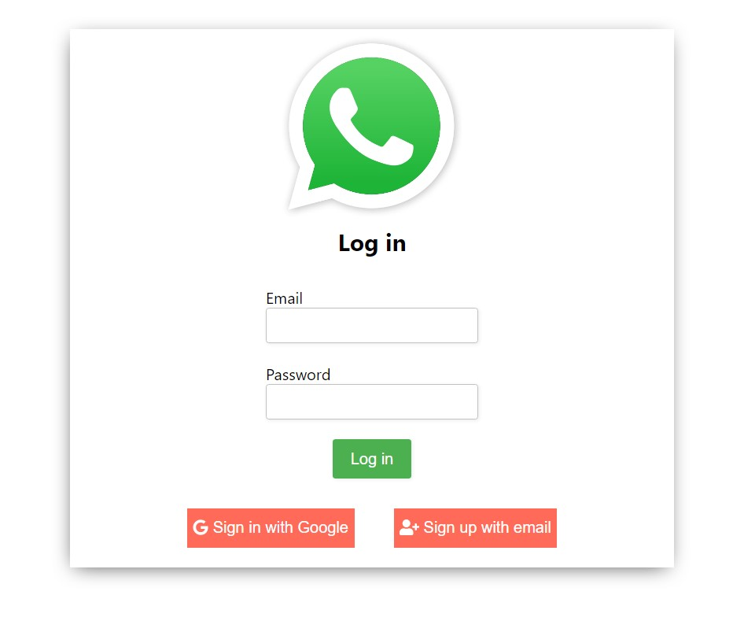
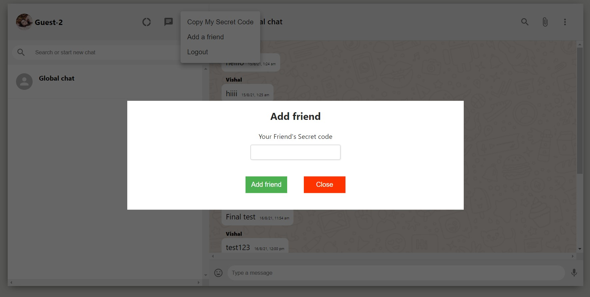

# Whatsapp-Clone-Server
### _**MERN build**_ - https://whatsapp-clone-client-vishal.herokuapp.com/

<!-- ABOUT THE PROJECT -->
# About The Project
### **❗ Important**: This is the Server of the main Whatsapp clone project.

### Client - https://github.com/Vishal-tech/Whatsapp-Clone-Client

**Whatsapp Clone** is a real time messaging application that imitates the working of famous messaging app "Whatsapp". Unlike the real Whatsapp , this web app stores the messages in the cloud Database and authentication is done using Firebase Auth.

### Built With

* MongoDB
* Express.js
* ReactJS
* Node.js
* [Pusher](https://www.npmjs.com/package/pusher) :
  Pusher Channels provides realtime communication between servers, apps and devices. Channels is used for realtime charts, realtime user lists, realtime maps, multiplayer gaming, and many other kinds of UI updates.

* Authentication - Firebase
* Deployment - Heroku

# Features

* Signup/Login using email and password
* Realtime messaging
* Add friend

# Demo
  1. Login/Signup using you email and password\
    (or)\
    <u>Demo Sign in<u>\
    Guest-1\
    email: abc@gmail.com\
    password: waclone321#
    
   
  
  2. Copy your secret code
     

  3. Open another browser/incognito and Login using another account\
    Demo Sign in\
    Guest-2\
    email: xyz@gmail.com\
    password: waclone321#

  4. Open Add friend in Guest-2 and paste Guest-1's secret code to get connected

  

  5. Send messages to see realtime changes.
